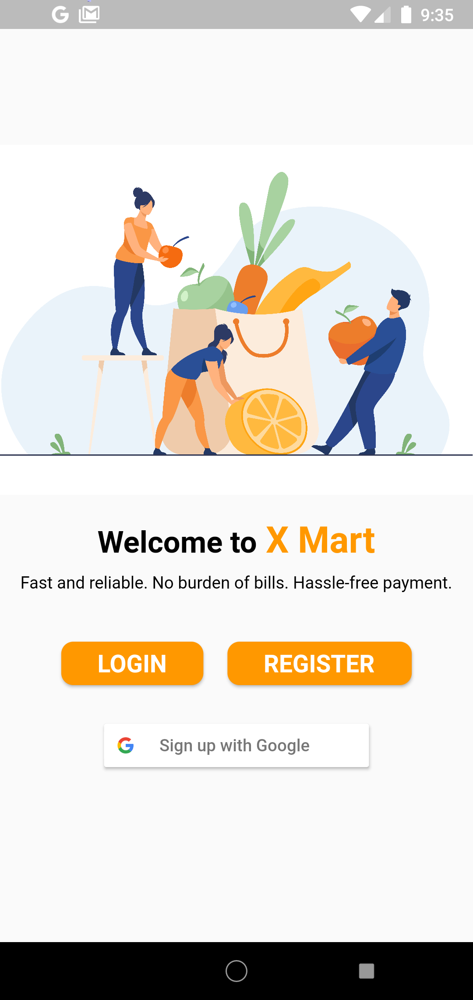
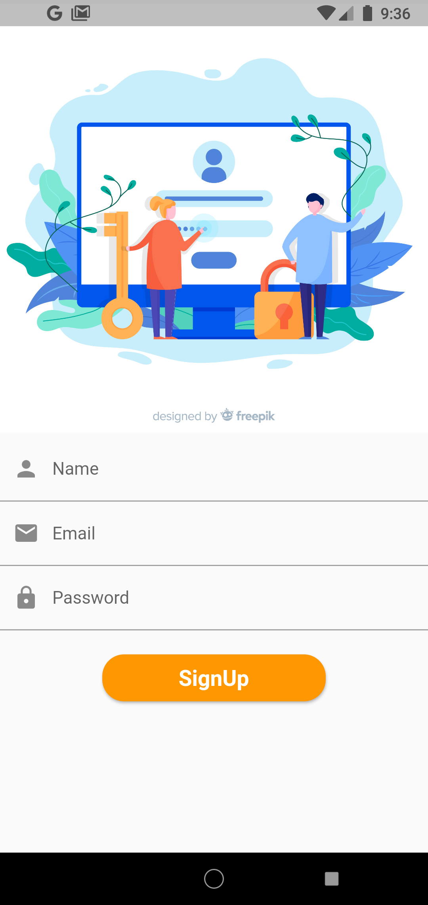
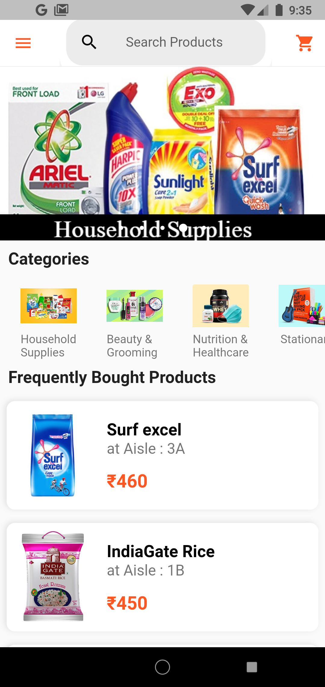
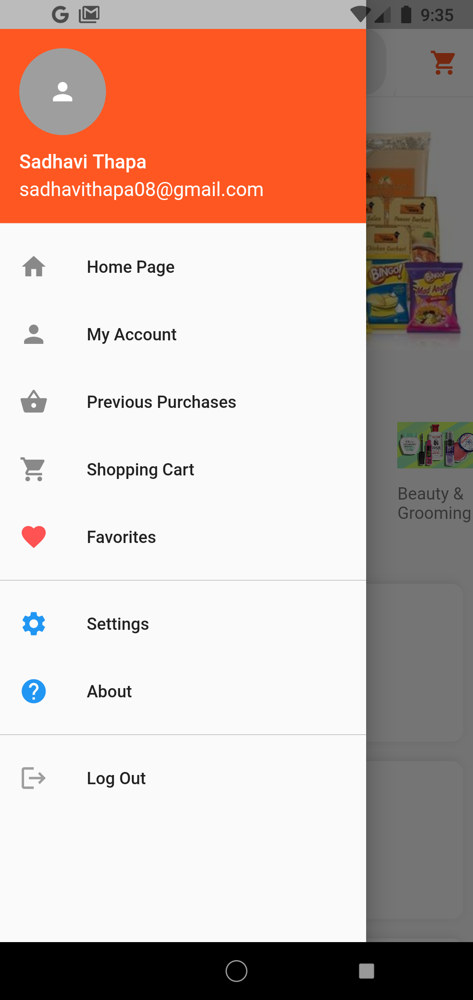
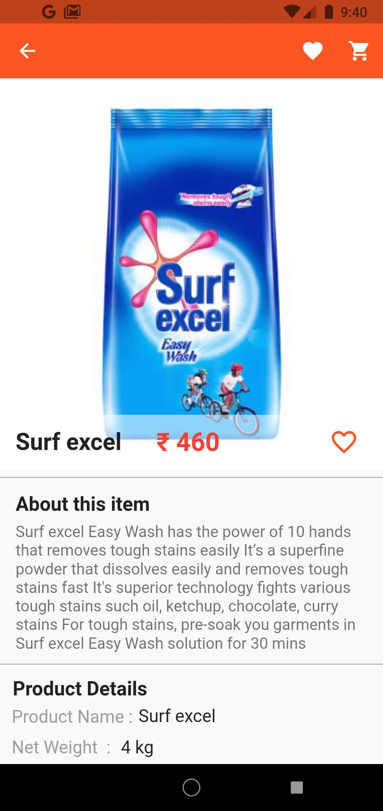
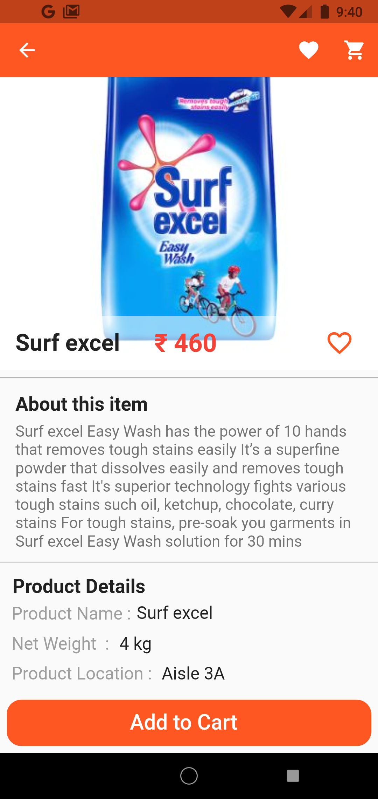

# Flutter Application

This application is for SUPERMARKET BILLING . Providing customers a way for easy checkout with standing in long queues, instead thye can directlly use this application to generate bill - by adding products to the cart in the application and later just pay at time of checkout . Customer can search of item , find thier location (eg. aisle 4a), add item to cart, remove item etc.

For the backend we used Firebase which is Google's mobile platform that helps you quickly develop high-quality apps and used to grow your business. It was used to store the details of our products, User informations, login details and other things.

For now the customer are only given option to pay at counter but later we can add online payment methods which will be more fesible for customer and many prefer online payment  methods.

## Getting Started

This project is a starting point for a our first Flutter application.
Here are some snapshots for our application.

 

A few resources to get you started if this is your first Flutter project:

- [Lab: Write your first Flutter app](https://flutter.dev/docs/get-started/codelab)
- [Cookbook: Useful Flutter samples](https://flutter.dev/docs/cookbook)

For help getting started with Flutter, view our
[online documentation](https://flutter.dev/docs), which offers tutorials,
samples, guidance on mobile development, and a full API reference.
